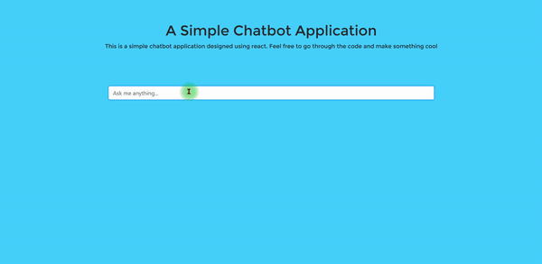
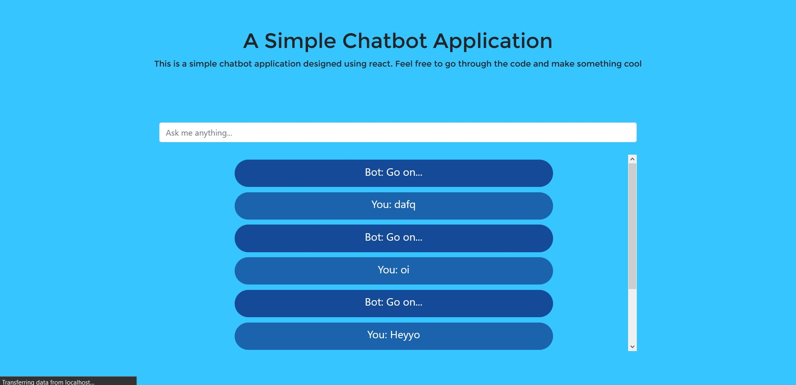

# A Simple Chatbot Application

This is a simple chatbot made using React. This was inspired from Kim Nguyen's article on making a simple chatbot demo based on her virtual assistant Stewy used in Hipstew.

The styles for the components are inside the components/styles folder. The sass contains the sass files for the styles if you wanna have a look.

#### Demo:

#### SS:

#### Link to the app:

https://chattie-by-manishkd.web.app

#### Link to the article:

https://dev.to/kimmese/how-to-speak-robot-4pa0

#### Link to the original demo by Kim:

https://github.com/nnhk23/chat-bot-example